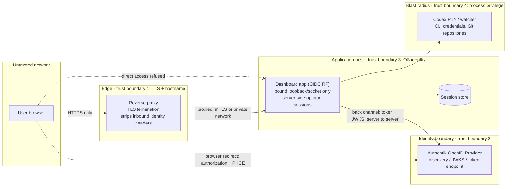

# Security roadmap: from loopback-only to an authenticated deployment

## Purpose and honest current posture

### Implementation status (2026-08-21)

The repository contains an authenticated ASGI runtime selected with
`auth_mode = "oidc"`. It uses Starlette/Uvicorn, Authlib Authorization Code +
PKCE, strict issuer/subject-or-group decisions, an asymmetric ID-token algorithm
allowlist, opaque SQLite-backed sessions, per-session CSRF tokens, security headers,
signed back-channel logout, abuse controls, and redacted audit events. The anonymous
runtime remains available only as the enforced loopback `local` mode. Automated
application evidence is recorded in `docs/RELEASE_EVIDENCE.md`.

This is implementation progress, **not a declaration of network readiness**. A live
Authentik integration, TLS proxy isolation, dedicated service identity, secret
delivery, backup/revocation procedures, and the adversarial deployment checks later
in this document remain to be completed and evidenced.

This document is the decision record for taking the coordination dashboard from
its original **single-user, loopback-only development mode with no
authentication** to something the owner could expose on a network behind an
identity provider without lying to themselves about the risk.

Current posture, stated plainly:

- Both modes now use Starlette/Uvicorn. `auth_mode = "local"` has **no user
  authentication, no TLS, and no per-user authorization**; it uses an opaque
  local browser session only for CSRF/audit continuity and refuses any
  non-loopback bind address.
- `auth_mode = "oidc"` additionally uses Authlib. It implements the
  application controls listed in the implementation-status section above, but
  it has not yet been exercised against the owner's live Authentik deployment
  or its intended TLS reverse proxy.
- Anyone who can reach either mode after passing whatever boundary it provides
  has the full power of the tool, including a live PTY into `codex -C <repo>`
  running as the server's OS user with that user's inherited Codex login.

**Local mode is not network-ready, and OIDC mode is not yet a completed
deployment.** Loopback stops being an adequate boundary the moment the host is
shared, the port is forwarded, or a tunnel is pointed at it. OIDC mode still
needs the proxy, TLS, service identity, and operational evidence in this plan.

**OIDC alone is not sufficient.** Adding sign-in to the HTML shell while the API
routes stay anonymous, or while the upstream port stays reachable, moves the
login prompt without moving the security boundary. Authentication is one item on
an ordered list; the exit criteria in the phased roadmap are what actually gate
exposure.

## What is being protected

### Assets

| Asset | Where it lives | Why it matters |
| --- | --- | --- |
| Interactive Codex PTY | `/ws/terminal`, `/api/codex/*`, `codex_session.py` | Arbitrary interactive command execution as the server's OS user, using the owner's authenticated Codex CLI session. Highest-value asset by a wide margin. |
| Automatic watcher control | `/api/watcher/start`, `/api/watcher/stop` | Starts/stops a process that spends provider quota and writes to a real project repository. |
| Repository selection | `/api/repository/select` | Chooses which local Git repository the tool operates on, and therefore what the PTY and watcher can reach. |
| Repository setup | `/api/repository/create`, `/api/repository/initialize` | Creates a direct-child Git repository or installs coordination files and an owner-confirmed, non-overwriting GitHub Actions workflow into the selected repository. |
| Coordination state and relay log | `/api/state`, `/api/events` | Discloses task packets, reports, reviews, and recent agent output — project content, prompts, and file paths. |
| Security administration | `/api/activity`, `/api/sessions/*`, `/api/diagnostics` | Discloses redacted security/runtime data and can revoke browser sessions. |
| Repository catalog | `/api/state` | Discloses the names and paths of sibling repositories under `repositories_root`. |
| Host identity and credentials | Filesystem of the server's OS user | The Codex/Claude CLI credentials and Git identity the process inherits. Never sent to the browser, but fully reachable from a PTY. |

### Controls implemented in the repository

- Default loopback bind (`127.0.0.1`) and a code-level refusal to bind local
  mode to a routable address.
- One fixed, non-configurable Codex launch command resolved at server
  construction; no request can change the program, its arguments, or its working
  directory.
- Same-origin/`Sec-Fetch-Site` refusal and CSRF validation on state-changing
  `POST` routes; origin, authentication, and CSRF validation on the terminal
  WebSocket handshake.
- Bounded request and WebSocket message bodies, plus strict body and
  query-parameter validation on control routes.
- Repository discovery restricted to Git direct children of `repositories_root`
  plus the already-configured active repository.
- Repository creation restricted to validated direct-child names, and
  coordination initialization invokes a fixed bundled script without a shell.
- In OIDC mode: default-deny middleware, Authlib discovery and ID-token
  validation, exact issuer and asymmetric-algorithm checks, subject/group allow
  policy, opaque SQLite sessions, login rotation, idle and absolute expiry,
  POST-only provider-aware logout, CSRF tokens, exact trusted hosts, security
  headers, redacted security/control audit events, and browser session revocation.

### Controls not yet demonstrated for a network deployment

- TLS termination or transport confidentiality.
- A live Authentik integration and negative-token validation evidence against
  the real provider.
- Proxy isolation proving that only the reverse proxy can reach the upstream.
- An installed dedicated service identity and verified systemd hardening.
- Rehearsed secret rotation, session revocation, backup, and restore procedures.

### Trust boundaries today

Local mode still has exactly one boundary: the loopback socket. OIDC mode adds an
application identity boundary, but the target proxy, TLS, network isolation, and
service-account boundaries do not exist merely because the code supports them.

### Attacker impact in local mode or after an OIDC bypass

| Attacker capability | Consequence |
| --- | --- |
| Any HTTP client reaching the port | Full interactive shell via the Codex PTY, as the server's OS user, with the owner's Codex login. Complete host compromise for that user. |
| Read-only requests only | Full disclosure of coordination state, prompts, recent agent output, and local repository paths. |
| A malicious web page in the owner's browser | Blocked from control routes by the origin check for standard browser requests; still a defense-in-depth measure only, and no help against non-browser clients. |
| A local unprivileged user on a shared host | Same as the first row. Loopback is not an authorization boundary on a multi-user machine. |

## Target deployment architecture

The target is a single-owner (or small, explicitly-allowed group) deployment in
which the application is never directly reachable and never makes its own trust
decisions about network position:

- The browser talks only to a TLS-terminating reverse proxy.
- The proxy is the only client permitted to reach the application, which binds
  loopback or a private UNIX socket / container-internal address.
- The application is the OIDC Relying Party and validates identity itself.
- Authentik is the OpenID Provider; the application never sees the user's
  password or MFA material.
- The application runs as a dedicated, unprivileged OS identity, isolated by
  systemd or a container runtime.

Boundary rules that follow from the diagram:

1. **Boundary 1 (edge).** Only the proxy speaks to untrusted clients. It
   terminates TLS, enforces the canonical external hostname, and strips any
   inbound header the application would ever trust for identity.
2. **Boundary 2 (identity).** Authentication happens at Authentik. The
   application trusts assertions only after cryptographic validation, never
   because of where a request came from.
3. **Boundary 3 (application host).** The upstream is unreachable except from the
   proxy. This is enforced at the socket/firewall/network level, not by
   configuration convention.
4. **Boundary 4 (blast radius).** An authenticated session still leads to command
   execution, so the OS identity, filesystem access, and credential scope of the
   process are part of the security design, not an afterthought.

## Authentication: native OIDC with Authentik as the OpenID Provider

The application becomes a confidential OIDC Relying Party using the
**Authorization Code flow with PKCE (`code_challenge_method=S256`)**.

Required properties:

- **Discovery and keys.** Read the provider's OpenID configuration document at
  startup (and refresh periodically) rather than hard-coding endpoints. Fetch
  signing keys from the published JWKS URI over TLS, cache them, and support key
  rotation and `kid` selection. Never pin a single key by value in
  configuration.
- **Authorization request.** `response_type=code`, PKCE `S256` with a
  per-request high-entropy verifier, a per-request `state`, and a per-request
  `nonce`. Bind `state`, `nonce`, and the code verifier to the pre-login
  server-side session; reject any callback whose `state` is missing, unknown,
  expired, or already consumed (single use).
- **Redirect URI.** Exactly one registered, absolute HTTPS redirect URI using the
  canonical external hostname, matched by exact string comparison on the provider
  side. No wildcards, no path prefixes, no user-supplied `redirect_uri`.
  Post-login destination is carried in server-side session state, and any
  returned-to path must be validated as a local relative path.
- **Token exchange.** Authorization code redeemed over the back channel only,
  server to server, as a confidential client authenticating with its client
  secret. The code, the verifier, and the client secret never appear in a
  redirect, a log line, or browser storage.
- **ID token validation.** Verify the signature against the JWKS, then verify
  `iss` matches the configured issuer exactly, `aud` contains this client id
  (and reject unexpected `azp`), `exp`/`iat`/`nbf` within a small allowed clock
  skew, `nonce` matches the value bound to this session, and the algorithm is an
  expected asymmetric algorithm from an allowlist. Reject `alg: none` and
  reject symmetric algorithms unless deliberately configured.
- **Scopes.** Request the minimum needed — `openid` plus only the claims actually
  used for display and authorization (for example `profile` and the group or
  entitlement claim). No API scopes, no offline access, unless a concrete need is
  recorded here first.
- **No implicit or hybrid flow.** No `response_type=token`, no `id_token` in a
  redirect fragment. Current OAuth security best current practice removes implicit
  flow from acceptable options; the roadmap follows it.
- **Failure is a refusal.** Any validation failure ends in a generic error page,
  no session creation, and an audit event — never a partially trusted request.

## Sessions

- **Server-side, opaque.** The browser receives only a high-entropy random
  session identifier. The current implementation retains only the stable
  subject, display name, groups, and CSRF token; OAuth tokens are discarded
  after validation. **No tokens in `localStorage`, `sessionStorage`, or any
  JavaScript-readable location.**
- **Cookie attributes.** `HttpOnly`, `Secure`, `SameSite=Lax` (or `Strict` where
  the login redirect flow allows it), `Path=/`, host-only, and a `__Host-` prefix
  where the deployment supports it. No cookie domain widening.
- **Rotation.** Issue a fresh session identifier at every privilege change:
  immediately after successful login (defeating fixation), and after any future
  step-up. Invalidate the pre-login temporary session that carried `state`,
  `nonce`, and the verifier.
- **Expiry.** Both an absolute lifetime and an idle timeout, enforced
  server-side. Cookie expiry is a convenience for the browser, never the
  authority. Expired records are deleted, not merely marked.
- **Logout.** A state-changing `POST` that destroys the server-side record,
  clears the cookie, and offers provider-initiated (RP-initiated) logout at
  Authentik. A logout must not be reachable by `GET`.
- **Storage.** Session records live outside the browser and outside the
  repository tree in an owner-only SQLite database. They are durable across a
  normal restart and can be invalidated by stopping the service and removing
  the security database, or by adding a dedicated administrative revocation
  operation later.

## CSRF and logging discipline

- **Every state-changing endpoint** — watcher start/stop, Codex start/stop/input/
  resize, repository select, logout, and every future control route — requires a
  CSRF defense: a per-session synchronizer token submitted in a header or body
  and compared in constant time, in addition to the existing origin/
  `Sec-Fetch-Site` check and `SameSite` cookies. Defense in depth: no single one
  of these is the control.
- `GET` must remain side-effect free. Any endpoint that changes state is `POST`.
- **Cache control.** Authenticated HTML and all API responses use
  `Cache-Control: no-store` (plus `Pragma: no-cache` where legacy proxies matter).
  Callback URLs and error pages must not be cacheable.
- **Redaction.** Authorization codes, `state`, `nonce`, PKCE verifiers, tokens,
  cookies, and `Authorization` headers are never written to logs, never included
  in error pages, and never echoed in API responses. Query strings are stripped
  or allowlisted before request logging. The relay log surfaced through
  `/api/state` is agent output and must be treated as sensitive content, not
  debug noise.

## Authorization: default deny

Authentication answers "who"; it does not answer "may they". The application
needs an explicit allow decision on **every** request.

- **Default deny.** A single enforcement point rejects any request without a
  valid session and an allow decision. New routes are denied until explicitly
  allowed; the allowlist enumerates the small set of unauthenticated routes
  (login start, callback, and health) and nothing else. Logout and static assets
  require an authenticated session.
- **Stable subject.** Decisions are keyed on the OIDC `sub` claim (stable and
  provider-issued) and/or an Authentik group or entitlement claim. Never key on
  email, username, or display name — those are mutable and can be re-assigned.
- **Coverage.** Enforcement applies to `/api/state`, `/api/codex/start|stop|clear`,
  `/ws/terminal`, `/api/watcher/start|stop`,
  `/api/repository/select`, every static asset that reveals application content,
  and every future control route — **not merely the HTML shell**. Protecting only
  the page while the JSON and PTY endpoints stay anonymous is the specific
  failure mode this section exists to prevent.
- **Uniform refusal.** Unauthorized requests get a consistent status and body
  that does not disclose whether a resource exists, plus an audit event.
- **Least privilege inside the app.** Repository selection stays constrained to
  the configured `repositories_root` scan and the active repository; an
  authenticated user must not be able to widen that scope through the API.

## Reverse proxy, TLS, and forwarded headers

- **TLS everywhere externally.** HTTPS only, modern cipher configuration,
  automated certificate renewal, HTTP redirected to HTTPS, and HSTS once the
  hostname is confirmed correct and permanent.
- **The upstream is unreachable except from the proxy.** Bind loopback, a UNIX
  socket, or a container-internal network, and enforce it with host firewall
  rules or network policy. "It is only documented as internal" is not an
  enforcement mechanism.
- **Forwarded headers are untrusted input.** `X-Forwarded-For`,
  `X-Forwarded-Proto`, `X-Forwarded-Host`, and `Forwarded` are honored **only**
  when the peer is the known proxy, with a configured trusted-proxy count/list;
  otherwise they are ignored. The proxy must overwrite, not append to,
  client-supplied values.
- **Identity headers are stripped at the edge.** Any header the application could
  ever read as identity (for example `X-Authentik-*`, `X-Forwarded-User`,
  `X-Remote-User`) is unconditionally removed from inbound requests by the proxy,
  even in the native-OIDC design where the application does not read them. This
  removes a whole class of header-spoofing bugs by construction.
- **Canonical host.** The application derives its external URL from
  configuration, not from the `Host` header, so redirect URIs and cookie scoping
  cannot be manipulated by a request.
- **Security headers** are set deliberately (see the OWASP HTTP headers guidance
  in the references): a restrictive `Content-Security-Policy` compatible with the
  vendored terminal assets, `X-Content-Type-Options: nosniff`,
  `Referrer-Policy: no-referrer` (or `same-origin`), a restrictive
  `Permissions-Policy`, and frame-ancestors denial. Ownership of each header
  (proxy or application) is decided once and written down, so headers are neither
  duplicated nor silently dropped.

## Native OIDC versus Authentik forward auth

**Recommendation: implement native generic OIDC in the application as the
authentication contract.**

| | Native OIDC in the app | Authentik forward auth (proxy provider) |
| --- | --- | --- |
| Where the decision lives | In application code, visible and unit-testable | In proxy + provider configuration |
| Semantics | Explicit: issuer, audience, nonce, expiry, session, authorization | Implicit: "the proxy said so" |
| Failure mode if bypassed | Request still refused — the app validates for itself | Full anonymous access, since the app trusts headers |
| Testability | Deterministic tests against a fake/known provider | Requires deployment-level integration testing |
| Portability | Works with any conformant OpenID Provider | Coupled to Authentik's proxy provider |
| Cost | Application work plus a dependency on a maintained OIDC library | Little application work |

Forward auth is documented here as an **optional additional deployment
boundary**, best used as an outer gate in front of native OIDC. It is sound as
an authentication boundary **only where direct access to the application
upstream can be prevented** — the proxy is provably the only path a request can
take to reach it (loopback or private-network bind, firewall rules, or a
network namespace the proxy alone can enter). Where the upstream cannot be
isolated that way, forward auth is not a boundary at all: anyone who can reach
the upstream directly simply skips it.

If forward auth is ever used alone, the application trusts headers, so the
proxy **must** strip every inbound identity header from client requests before
setting its own, and must be the only path to the upstream. Both properties are
requirements to be tested — by sending forged identity headers through the
proxy and by attempting a direct upstream connection from another host — not
assumptions to be stated. The application should not be built so that
header-based identity is its only authentication path.

## Dependencies and platform

Two prerequisite decisions are recorded here as **implementation prerequisites,
not choices made by this document**:

1. **Do not hand-roll security primitives.** No custom JOSE/JWT verification,
   no custom OIDC state machine, no custom session framework. Select a
   maintained, widely used OIDC/OAuth client library and a maintained JOSE
   implementation, and use the framework's session support rather than writing
   one. Hand-rolled crypto and protocol code is the most common source of silent
   authentication bypasses.
2. **Do not serve production traffic from `http.server`.** The Python
   documentation states plainly that `http.server` is not recommended for
   production: it implements only basic security checks. The current stdlib-only
   design is correct for a loopback development tool and is not a defensible
   production base. Authenticated network deployment requires a
   production-capable server/framework (for example an ASGI/WSGI application
   served by a production server), selected in a dedicated decision that also
   accounts for the PTY/streaming requirement.

Both decisions expand this repository from "standard library only" to "has
dependencies", which changes packaging, CI, and update expectations. That
tradeoff is deliberate and must be accepted explicitly before implementation
starts. Once accepted: pin dependencies, record hashes where supported, enable
dependency and vulnerability scanning in CI, and treat security updates for the
OIDC/JOSE/server stack as time-bounded operational work.

## Host, process, and operational hardening

- **Dedicated OS identity.** A purpose-made unprivileged service account, not the
  owner's login account. It owns only what it needs: the application directory,
  the session store, and the coordinated repositories it is meant to touch.
- **Least filesystem and CLI credential access.** The service account's Codex/
  Claude CLI credentials are scoped to that account. A compromised session should
  not yield the owner's personal SSH keys, browser profile, password manager, or
  unrelated repositories. Accept explicitly that an authenticated session still
  implies command execution as that account — that is the design of the tool, and
  it is why authorization is deliberately narrow.
- **systemd/container hardening.** Run under a supervisor with restart policy and
  resource limits, plus hardening directives: `NoNewPrivileges`,
  `PrivateTmp`, `ProtectSystem=strict`, `ProtectHome` with explicit
  `ReadWritePaths`, `ProtectKernelTunables`, `ProtectControlGroups`,
  `RestrictAddressFamilies`, `RestrictSUIDSGID`, `MemoryDenyWriteExecute` where
  compatible, and a minimal capability set. Containers: non-root user, read-only
  root filesystem, dropped capabilities, no host network.
- **Secrets.** The OIDC client secret and session signing/encryption keys are
  injected from a secret store or a root-owned environment/credentials file with
  restrictive permissions — never in the repository, never in
  `workflow.example.toml`, never in a command line, never in logs. Rotation is a
  documented, rehearsed procedure with an expected rotation interval.
- **Audit events.** Structured, redacted events for login success/failure,
  authorization denial, session creation/rotation/destruction, watcher
  start/stop, Codex session start/stop, and repository switch — each carrying the
  subject identifier, timestamp, source address, and outcome. Logs are retained
  with a stated period and protected from casual reading.
- **Backup and recovery.** Coordination state and configuration have a stated
  backup expectation and a rehearsed restore. Session state is intentionally
  disposable. Recovery includes a documented way to revoke access immediately:
  disable the Authentik application/group, invalidate all server-side sessions,
  and stop the service.

## Phased roadmap

Each phase has falsifiable exit criteria. A phase is complete only when every
criterion has been demonstrated by a test or a recorded manual check; "believed
true" does not count.

### Phase 0 — Truthful baseline (documentation only)

**Status: complete.**

- **Exit:** This document exists; the README distinguishes local and OIDC mode,
  states the remaining deployment limitations, and links here.

### Phase 1 — Platform decision

**Status: complete in the repository.** ADR 0001 records the decision and the
authenticated route tests exercise the shared PTY/control surface on ASGI.

- **Exit:** A written decision records the server/framework and the OIDC and
  JOSE libraries, with versions and support expectations; the dependency,
  packaging, and CI consequences are accepted; the PTY/streaming requirement is
  demonstrated to be satisfiable on the chosen stack by a spike.

### Phase 2 — Enforcement skeleton (still loopback)

**Status: complete in automated tests.**

- **Exit:** A single default-deny enforcement point covers every route; a test
  enumerates the application's routes and fails if any route is reachable
  anonymously without being on the explicit unauthenticated allowlist; adding a
  new route without a decision fails that test.

### Phase 3 — OIDC login against Authentik

**Status: application implementation complete; live-provider evidence pending.**
The Authlib flow and negative cases are tested with controlled provider responses;
live Authentik integration remains an exit criterion.

- **Exit:** Authorization Code + PKCE `S256` login succeeds end to end;
  automated tests prove refusal for each of: bad signature, wrong `iss`, wrong
  `aud`, expired token, missing/mismatched `nonce`, missing/replayed/expired
  `state`, `alg: none`, and an unregistered `redirect_uri`; no token or code
  appears in any log or in browser storage.

### Phase 4 — Sessions and CSRF

**Status: implemented and covered by local automated tests; deployment evidence
remains outstanding.**

Signed OIDC back-channel logout is now implemented with issuer, audience, time,
event, `sub`/`sid`, asymmetric-algorithm, and replay checks. A consumed-token table
makes `jti` use atomic with session revocation, and update-only session persistence
prevents an in-flight request from resurrecting a revoked record.

- **Exit:** Sessions are server-side and opaque; the session identifier rotates
  on login; absolute and idle expiry are enforced server-side and tested; logout
  destroys the server-side record and is `POST`-only; every state-changing
  endpoint rejects a request with a missing or wrong CSRF token, proven by a test
  per endpoint; cookies carry the required attributes.

### Phase 5 — Authorization policy

**Status: implemented and covered by local automated tests; live Authentik claim
mapping remains outstanding.**

- **Exit:** Access requires an allowlisted `sub` and/or Authentik group claim;
  a valid token from a non-allowed subject is refused on every route, proven by a
  test; the deny path emits an audit event and discloses nothing about the
  resource.

### Phase 6 — Deployment boundary

**Status: not deployed.**

- **Exit:** TLS terminates at the proxy with a valid certificate and automated
  renewal; a connection attempt directly to the upstream from another host fails;
  forwarded headers from a non-proxy peer are ignored, and inbound identity
  headers are stripped at the edge, each proven by a recorded probe; security
  headers are present on authenticated responses.

### Phase 7 — Hardening and operations

**Status: application implementation complete; host rehearsal pending.** A hardened
example unit, abuse controls, locked dependency audit, database verification, and
backup/restore commands exist; installation, rotation, and operational evidence remain.

- **Exit:** The service runs as a dedicated account under the hardening
  directives; secrets come from the chosen store and a rotation has been
  rehearsed once; audit events exist for every listed action with redaction
  verified; dependency scanning runs in CI and fails on known-vulnerable
  versions; a restore from backup has been performed once.

### Phase 8 — Adversarial review

**Status: not started.**

- **Exit:** A deliberate attempt to reach each asset without a valid session
  fails; the checklist below is complete with dated evidence; residual risks are
  written down and accepted by the owner in writing.

## Network-ready checklist

Exposure is permitted only when **every** line is true:

- [x] The platform decision is recorded, and the app is no longer served by
      `http.server`; both local and OIDC modes use Starlette/Uvicorn.
- [x] Default-deny enforcement covers every route, verified by a route-enumeration
      test — not just the HTML shell.
- [ ] OIDC Authorization Code + PKCE `S256` against Authentik, with signature,
      `iss`, `aud`, `exp`, and `nonce` validation, each negatively tested.
- [x] No implicit flow; no tokens in browser storage; strict single registered
      redirect URI.
- [x] Server-side opaque sessions with rotation on login, absolute and idle
      expiry, and working `POST` logout.
- [x] Cookies are `HttpOnly`, `Secure`, `SameSite`, host-scoped.
- [x] CSRF defense on every state-changing endpoint, tested per endpoint.
- [x] Authorization is keyed on `sub` and/or an Authentik group, default deny.
- [ ] TLS at the proxy; the upstream is provably unreachable from anywhere else.
- [ ] Forwarded headers trusted only from the proxy; inbound identity headers
      stripped at the edge.
- [x] Security headers and `no-store` on authenticated responses.
- [ ] Dedicated OS identity with hardening directives applied.
- [ ] Secrets injected from the chosen store, never in the repository; rotation
      rehearsed.
- [x] Redacted audit events for login, denial, session lifecycle, watcher, Codex
      session, and repository switch.
- [x] Dependency scanning in CI, with a stated patch expectation.
- [ ] Backup and restore rehearsed; immediate revocation procedure documented.
- [ ] Residual risk — an authenticated user still gets command execution as the
      service account — is written down and accepted.

## Non-goals

- Multi-tenancy, per-user data separation, or role hierarchies beyond
  "allowed / not allowed".
- Turning the Codex PTY into a sandboxed or restricted shell. It is an
  interactive shell by design; the mitigation is who may reach it and as which OS
  identity it runs.
- Becoming a hosted or multi-user product, or offering a security guarantee to
  third parties.
- Implementing or operating Authentik itself, or documenting the owner's private
  infrastructure.
- Defending against an attacker who already has local access as the service
  account or as root.
- Compliance certification of any kind.

## Open owner decisions

These block implementation and are not decided by this document:

1. **External URL** — the canonical public hostname and path for the application.
2. **Authentik configuration** — issuer URL, application/provider slug, and
   client id, with the confidential client's client secret held in the chosen
   secret store.
3. **Authorization subject** — the allowed `sub` value(s) and/or the Authentik
   group or entitlement claim used for the allow decision, and which claim
   carries it.
4. **Session lifetime** — absolute lifetime and idle timeout values, and whether
   sessions survive a service restart.
5. **Deployment and runtime** — server/framework and OIDC/JOSE libraries; systemd
   user service versus system service versus container; which reverse proxy.
6. **Secret store** — where the client secret and session keys live, how they are
   injected, and the rotation interval.
7. **Scope of exposure** — private network/VPN/tunnel only, or public internet;
   this changes the acceptable residual risk materially.

## References

- Authentik — OAuth2/OpenID provider configuration:
  <https://docs.goauthentik.io/add-secure-apps/providers/oauth2/>
- Authentik — proxy provider forward auth:
  <https://docs.goauthentik.io/add-secure-apps/providers/proxy/forward_auth>
- RFC 9700 — Best Current Practice for OAuth 2.0 Security:
  <https://www.rfc-editor.org/info/rfc9700>
- OpenID Connect Core 1.0:
  <https://openid.net/specs/openid-connect-core-1_0-18.html>
- Python — security considerations for standard library modules (including
  `http.server`): <https://docs.python.org/3/library/security_warnings.html>
- OWASP — Session Management Cheat Sheet:
  <https://cheatsheetseries.owasp.org/cheatsheets/Session_Management_Cheat_Sheet.html>
- OWASP — Cross-Site Request Forgery Prevention Cheat Sheet:
  <https://cheatsheetseries.owasp.org/cheatsheets/Cross-Site_Request_Forgery_Prevention_Cheat_Sheet.html>
- OWASP — HTTP Headers Cheat Sheet:
  <https://cheatsheetseries.owasp.org/cheatsheets/HTTP_Headers_Cheat_Sheet.html>
